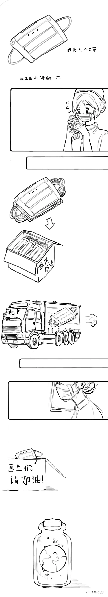

Starfish, a story.
短发短发短发短发的方法


我是一只小口罩，

出生在忙碌的工厂。

前辈们守护着的工人们，

为我穿好蓝衣裳 系好白辫子。

I’m a face mask,

Born in a loud, busy factory.

My predecessors protected those that now put me together.

They dressed me in baby blue and gifted me with two white strings,


我同无数个和我一个样的兄弟姐妹，

随着口哨声，钻进大箱子里。

叔叔阿姨给我们点名，

抱着箱子进卡车，上路。


And reunited me with my trillions of brothers and sisters.

We were stacked in big roomy boxes,

Loaded into trucks after one final headcount,

Then sent on our way.


前方是一条怎样的路呢?

我从箱子的封口处侧耳聆听。

这世界出奇的安静

好似被丢进了一个冷水罐子里。

I have no idea what roads lie ahead,

I could hear not a single sound from outside

It was as if the world beyond had been silenced, or frozen.



召集我们的叔叔阿姨和我们说过，

原来的生活不是这般；


I heard that

The world wasn't like this before


人们本该在假日随意上街

同心爱的人肆无忌惮的牵手，拥吻，

回到家和亲人一起包饺子，看电视 ；

但是病毒来临的消息

打乱了这一切 。

There used to be people on the streets,

With their loved ones, linking arms, holding hands,

Cooking, watching movies, bonding.

It was the virus that ended that world,

Stopped everything.


“我们必须做点什么。” 他们说，

还有很多人在奔走，努力，

为了把我们平安送到医院，

为了一切能恢复原样。

"We need to do something." They said

There are people working their hands until they're dry and cracked, 

People who don't stop for days at a time,

Simply to bring us to safety.

To bring back that noisy, joyous world. 


车停了，箱子动了，

我们在一间白色的房间睁开眼睛。

他和她是防护服包住的年轻医生，

他们看上去很累，

脸上已留下战斗的痕迹。

The truck stopped, and the box was lifted.

I opened my eyes to a sterile white room,

And there they stood, who young doctors in protective gear,

Waiting for us.

He looked so tired,

His face lined with red welts, scars from the ferocious war.


但他们微笑着，

轻轻摘下上一个，

他托起我，她也戴上一只。

动作简洁，熟练……

那定是两个强大的面庞。

But he still smiled,

Lightly took off his mask,

Delicately lifted me up to his face to be next of service.

She picked one up too and covered up her gentle smile.

 


她有话要告诉他和我，

两只眼睛闪着微弱的光；

我知道

每日每夜的工作让人喘不过气，

或许我们会感到害怕与无助，

但是

-

It seemed as though she had something to say,

 to him, and to me.

It filled her eyes with a soft, somber light.

And I knew. They worked unendingly,

Barely stopping long enough to take the next breath.

Maybe that should scare us, or make us feel helpless.

But,


如果心里装着想要守护的人，

念着希望，

想着由我们去创造的明天，

相信自己奉献存在意义，

这世界上，也许不会有什么无法战胜；

If we hold love and hope in our hearts,

Each day will begin brighter than the one before.

And maybe in this world, nothing will be indomitable.


我悄悄对他说，

当你难受的时候，

就轻轻拉一下我的手，

不用害怕，我会一直为你守护。

I whispered to them,

If you’re upset

Take my hand.

I will always be there, with you


他轻轻眨了眨眼，似乎在微笑

和她一起，走上那条走廊，

去帮助那些等待着的病人，

那些不该被病毒伤害的一切。

She blinked, and though I couldn’t see her smile

I felt it.

They started down the hall,

Heading towards those waiting patients,

To save those that never should have been hurt.


我会静静的等待，

等到他和她可以走出医院的那天，

直到我们不再被需要，

他拉着她的手，

温柔的把我放下，

我就能再看见，

他们幸福的脸。

I will wait

Til the day they walk out of this white building

Til the day we are no longer needed.

When he gently takes me off

And I may finally see

The joy on his worn face.


远方的天空会是那么纯洁，

那么灿烂，

自由地漂浮着的云朵，

就如同最初的模样。

The sky would be pure,

Bright,

Clouds will frolic in the brilliant baby blue,

Filled with more joy than ever before.

<!--## Testing

<i>Testing</i>, <b>testing</b>

## How to Use This Theme
Just go ahead and read up on [how to install Jekyll](https://jekyllrb.com/). It's not too hard I promise!

Download this repository [here](https://github.com/iwiedenm/jekyll-theme-massively) and save it to any folder you want.

Open a terminal window or a command line and ```cd``` to that location.

Then enter: ```bundle exec jekyll serve```. You can now access your new Jekyll site from [http://127.0.0.1:4000/](http://127.0.0.1:4000/). Have fun exploring your new site!

## Features
### Auto-Generating Sitemap
The sitemap is auto generated! Just simply change the front matter of each site. It looks like so...
```
sitemap:
    priority: 0.7
    lastmod: 2017-11-02
    changefreq: weekly
```
### Formspring integration
The contact form below each page on the footer actually collects information! Just change your email address in the ```_config.yml``` file!

-->


